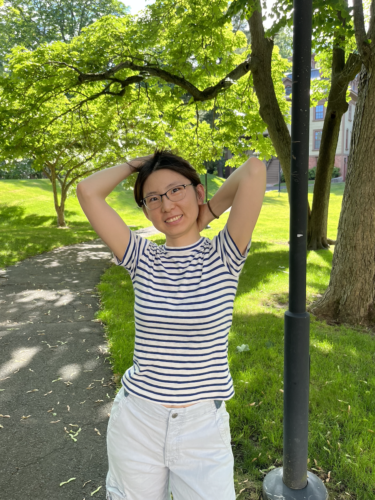

<link rel="stylesheet" href="style2.css">

<!--- -->

Hello! I am a 5th-year math graduate student at [Yale](https://math.yale.edu/). My advisor is Prof. [Ivan Losev](https://gauss.math.yale.edu/~il282/).

I study geometric representation theory. I am interested in Harish-Chandra modules, deformation quantizations, Nakajima quiver varieties, and nilpotent orbits.

<!---Here ia my [CV]().-->

Email: m.hu@yale.edu

Office: KT 817
 
<!---**Upcoming traveling:**-->
<!---  -->

# Research
- On Certain Lagrangian Subvarieties in Minimal Resolutions of Kleinian Singularities, *coming soon*.
- [Presentations of Diagram Categories](https://journals.calstate.edu/pump/article/view/2256), *The PUMP Journal of Undergraduate Research, 3:1–25, 2020*.

# Talks
*Upcoming*
- 05/16-05/18/25, AWM Research Symposium Special Session, UW Madison

*Past*
- Mar 2025, Algebra Seminar, UOregon
- Mar 2025, Algebra Seminar, UCLA
- Jan 2025, Geometry, Symmetry and Physics Seminar, Yale
- Oct 2024, AMS Fall Western Sectional Meeting Special Session, UC Riverside
- Oct 2024, AMS Fall Eastern Sectional Meeting Special Session, UAlbany
- Sep 2024, Women in Mathematics in New England, <!---*student talk and graduate school panelist*,--> Smith College
- May 2024, Representation Theory and Related Geometry: Progress and Prospects, <!---*contributed talk*,--> UGA
