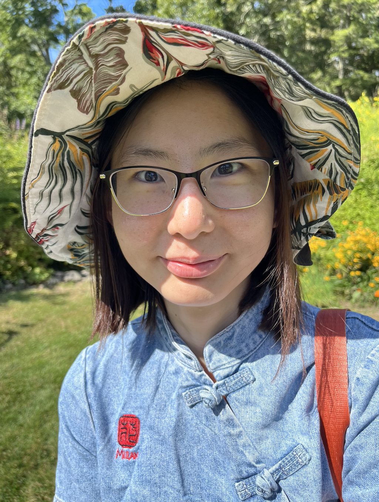

<link rel="stylesheet" href="style2.css">

Hello! I am a math graduate student at <a href="https://math.yale.edu/" target="_blank">Yale</a>. My advisor is Prof. <a href="https://gauss.math.yale.edu/~il282/" target="_blank">Ivan Losev</a>.

I work in geometric representation theory and symplectic geometry, with an emphasis on modules over quantizations and involutions of quiver varieties.

Email: m.hu@yale.edu. Office: KT 817.

Here is my <a href="CV/Mengwei Hu_CV.pdf">**CV**</a>.

<!---*** I am on the job market in Fall 2025.**-->
<!---  -->

## Research
- <a href="https://arxiv.org/abs/2504.08717" target="_blank">On Certain Lagrangian Subvarieties in Minimal Resolutions of Kleinian Singularities</a>, submitted, arXiv: 2504.08717, <a href="talks/Kleinian_singularities_poster.pdf" target="">poster</a>, <a href="https://www.youtube.com/watch?v=qmt49iaIwBQ" target="blank">talk</a>.
- <a href="https://journals.calstate.edu/pump/article/view/2256" target="_blank">Presentations of Diagram Categories</a>. *PUMP J. Undergrad. Res. 3 (2020), 1–25*.

## Travels
- March 17, <a href="https://math.nd.edu/events/" target="_blank" style="color : black;"><u>Cluster Algebras and Lie Theory Seminar</u></a>, University of Notre Dame
- March 28-29, <a href="https://www.ams.org/meetings/sectional/2329_special.html" target="_blank" style="color : black;"><u>AMS Southeastern Sectional Special Sessions</u></a>, Georgia Southern University, Armstrong Campus <!---*Special Session on algebraic, combinatorial and geometric aspects of representation theory*--><!---Special Session on Categorical, Homological and Combinatorial Methods in Noncommutative Algebra*-->
- April 28, <a href="https://www.math.lsu.edu/calendar?selecttime=all_future&selectevent=All" target="_blank" style="color : black;"><u>Algebra and Number Theory Seminar</u></a>, Louisiana State University
<!---July 2026, Summer Collaborators Program, Institute for Advanced Study, Princeton, NJ*-->

<!----*Upcoming*-->

## Talks
<!---*Past*-->
- Jan 2026, <a href="https://sites.google.com/view/rtg-northeastern/gprt-seminar" target="_blank" style="color : black;">Geometry, Physics, and Representation Theory Seminar</a>, Northeastern University
- Dec 2025, <a href="https://sites.google.com/view/seattlencalgebra2025/home?authuser=0" target="_blank" style="color : black;">Seattle Noncommutative Algebra Conference</a>, University of Washington, <a href="talks/Kleinian singularities_SNAC_Dec_2025.pdf">Slides</a>
- Dec 2025, <a href="https://www.imperial.ac.uk/pure-mathematics/seminars/geometry-algebra-and-theoretical-physics-seminars/" target="_blank" style="color : black;">Geometry, Algebra, and Theoretical Physics Seminars</a> (Zoom), Imperial College London
- Nov 2025, <a href="https://www.umass.edu/mathematics-statistics/events/mengwei-hu-yale-certain-lagrangian-subvarieties-minimal-resolutions-kleinian-singularities" target="_blank" style="color : black;">Representation Theory Seminar</a>, UMass Amherst
- Oct 2025, <a href="https://www.ams.org/meetings/sectional/2322_program_ss29.html#title" target="_blank" style="color : black;">AMS Fall Central Sectional Special Session</a>, SLU, <a href="talks/deformations_SLU_Oct_2025.pdf">Slides</a> <!----*Special Session on Geometry, Representation Theory and Noncommutative Algebra*-->
- Oct 2025, <a href="https://calendar.google.com/calendar/u/0/embed?src=ss4ps8h03v62f1vhuf40c2j87o@group.calendar.google.com&ctz=America/New_York" target="_blank" style="color : black;">Algebra Seminar</a>, UGA
- Sep 2025, <a href="https://sites.google.com/view/jhutopology/fall-2025?authuser=0" target="_blank" style="color : black;">Topology Seminar</a>, JHU
- Sep 2025, <a href="https://www.joshpollitz.com/algebra-seminar" target="_blank" style="color : black;">Algebra Seminar</a>, SU
- Sep 2025, <a href="https://www.acsu.buffalo.edu/~achirvas/alg/algebraseminar.html" target="_blank" style="color : black;">Algebra Seminar</a>, UB
- May 2025, <a href="https://sites.google.com/site/meeseongim/may_2025-conf-uwm?authuser=0" target="_blank" style="color : black;">AWM Research Symposium Special Session</a>, UW–Madison, <a href="talks/Kleinian_singularities_UW-Madison.pdf" target="">Slides</a>
- May 2025, Southeastern Lie Theory Workshop XV, CofC, <a href="talks/Kleinian_singularities_CofC.pdf">Slides</a>
- Mar 2025, Algebra Seminar, UO, <a href="talks/Kleinian_singularities_UO.pdf">Notes</a>
- Mar 2025, Algebra Seminar, UCLA, <a href="talks/Kleinian_singularities_UCLA.pdf">Notes</a>
- Jan 2025, Geometry, Symmetry and Physics Seminar, Yale, <a href="talks/Kleinian_singularities_Yale.pdf">Notes</a>
- Oct 2024, AMS Fall Western Sectional Meeting Special Session, UCR
- Oct 2024, AMS Fall Eastern Sectional Meeting Special Session, UAlbany
- Sep 2024, Women in Mathematics in New England, <!---*student talk and graduate school panelist*,--> Smith College
- May 2024, Representation Theory and Related Geometry: Progress and Prospects, <!---*contributed talk*,--> UGA
